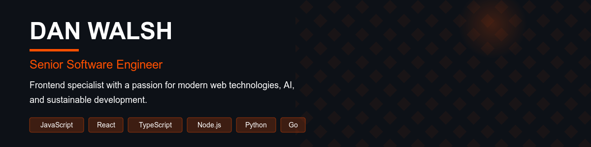

# DAN WALSH

## Full Stack Developer & AI Enthusiast

📍 London &nbsp;&nbsp; [@hello@danwalsh.co](mailto:hello@danwalsh.co) &nbsp;&nbsp; [🔗 Site](https://www.danwalsh.co) &nbsp;&nbsp; [🔗 GitHub](https://github.com/dang-w) &nbsp;&nbsp; [🔗 LinkedIn](https://linkedin.com/in/your-profile)

  

## SUMMARY

I'm a passionate developer with expertise in building scalable applications and exploring AI technologies. I enjoy solving complex problems and creating intuitive user experiences.

## SKILLS & TECHNOLOGIES

### Languages

  
  
  
  

### Frontend

  
  
  
  

### Backend

  
  
  

### Databases

  
  

### DevOps & Tools

  
  
  

### AI & ML

  
  

## FEATURED PROJECTS

### [Example MCP](https://github.com/dang-w/example-mcp)
This repository contains example implementations of Model Context Protocol (MCP) servers that can be used with Cursor IDE to enhance AI capabilities with custom tools and data sources.

### [Cursor Sync](https://github.com/dang-w/cursor-sync)
A tool to automatically synchronize Cursor IDE settings between multiple devices using a GitHub Gist.

### [ZSH Sync](https://github.com/dang-w/zsh-sync)
A tool to automatically synchronize ZSH shell settings between multiple devices using a GitHub Gist.

## GITHUB STATS

  

  

## HOW TO REACH ME

  
  
  
  

---

⭐️ From [dang-w](https://github.com/dang-w)